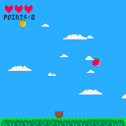
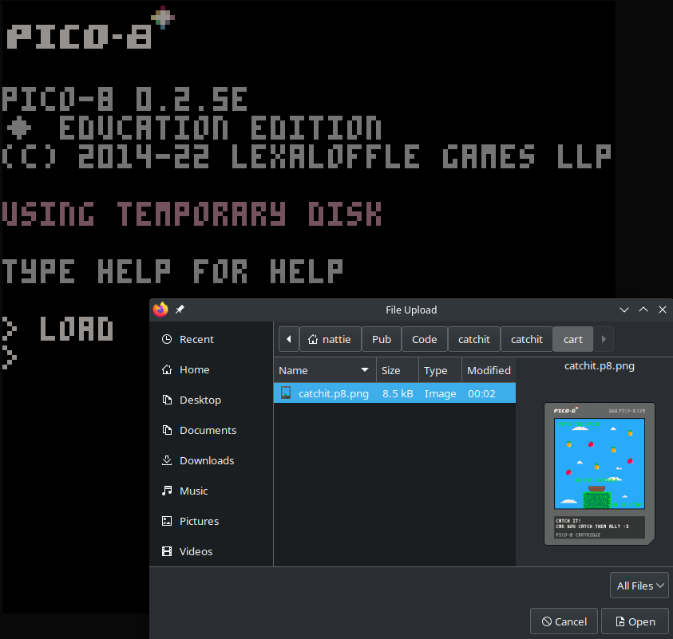
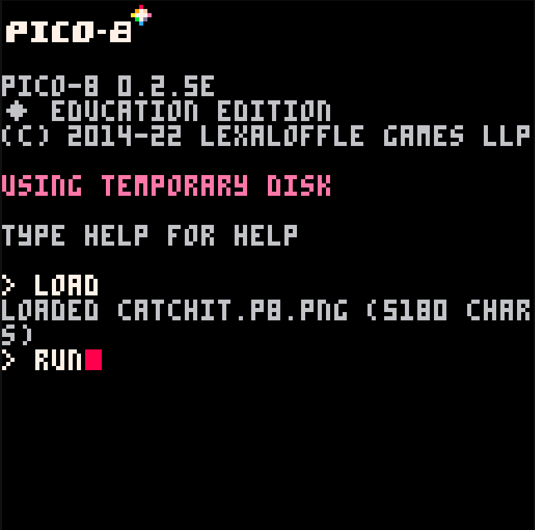
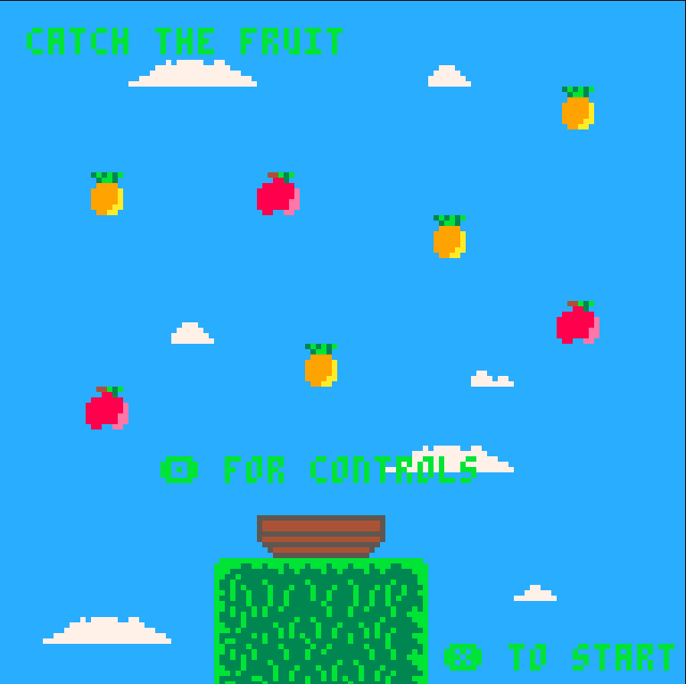

# Catch it!

My first ever game!

Since ive never made a game before, don't espect too much qwq

# Game in action:


# Installation:

# Play it at:

https://www.lexaloffle.com/bbs/?pid=124423#p

# Or compile it yourself!

```bash
git clone https://github.com/omoNattie/catchit

cd catchit
```

Done!

Now, the pico8 costs 15 dollars, but you can easily play my game for free by using their education edition.

Open up your favourite browser and go to this site,

https://www.pico-8-edu.com/

Once you're there type "load" and press enter, and a file loader should pop up, simply go to catchit's folder, and catchit/cart/ and load "catchit.p8.png".

Type "run" and press enter, done, have fun! 


# Pictured:






